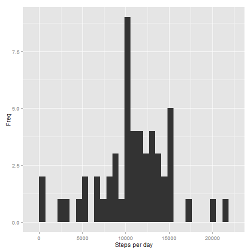
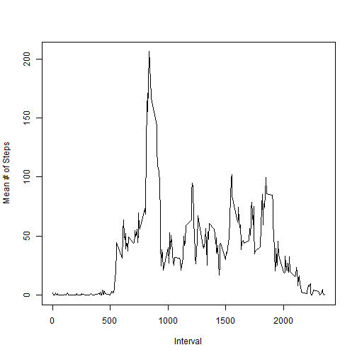
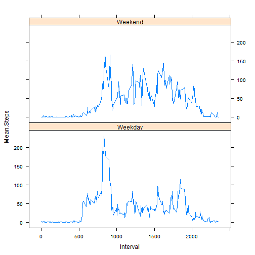

# Reproducible Research: Peer Assessment 1


## Loading and preprocessing the data

```r
library(knitr)
library(ggplot2)
data <-   read.csv(unz("activity.zip","activity.csv"))
## Change formatting
data$date <- as.Date(data$date)
## Remove missing values for now
data.noNA <- data[complete.cases(data),]
```

## What is mean total number of steps taken per day?
### Histogram of steps per day

```r
t1 <- with(data.noNA, tapply(steps, date, sum, na.rm=T))
qplot(t1, xlab="Steps per day", ylab="Freq")
```

```
## stat_bin: binwidth defaulted to range/30. Use 'binwidth = x' to adjust this.
```

 
### Median and mean steps per day

```r
summary(t1)[3:4]
```

```
## Median   Mean 
##  10800  10800
```
## What is the average daily activity pattern?

```r
t2 <- with(data.noNA, tapply(steps,interval,mean))
plot(x=names(t2),y=t2, type='l', xlab="Interval", ylab="Mean # of Steps")
```

 
### Interval with most steps

```r
names(which.max(t2))
```

```
## [1] "835"
```
## Imputing missing values
### Rows with missing values:

```r
nrow(data)-nrow(data.noNA)
```

```
## [1] 2304
```
### Impute missing values based on interval mean

```r
## create imputed interval values
int.mean <- with(data.noNA,tapply(steps,interval,mean))
int.mean.df <- data.frame(interval=as.integer(names(int.mean)), steps=as.integer(int.mean))
row.names(int.mean.df) <- NULL
## select rows with missing steps column and drop that column
data.NA <- data[!complete.cases(data),]
data.NA <- data.NA[,-1]
## add imputed values
data.imp <- merge(data.NA, int.mean.df)
## rejoin
data.imp2 <- rbind(data.noNA, data.imp)
## sort
data.imp2 <- data.imp2[order(data.imp2$date),]
row.names(data.imp2)<-NULL
```
### Histogram and mean/median calculation with imputed values added:

```r
t3 <- with(data.imp2, tapply(steps, date, sum))
qplot(t1, xlab="Steps per day", ylab="Freq")
```

```
## stat_bin: binwidth defaulted to range/30. Use 'binwidth = x' to adjust this.
```

 

```r
summary(t3)[3:4]
```

```
## Median   Mean 
##  10600  10700
```
### Change in mean/median results after adding imputed values:

```r
(summary(t3)-summary(t1))[3:4]
```

```
## Median   Mean 
##   -200   -100
```


## Are there differences in activity patterns between weekdays and weekends?

```r
library(lattice)
data.imp2$Weekday <- factor(weekdays(data.imp2$date) %in% c("Saturday","Sunday"),
  labels=c("Weekday","Weekend"))
## aggregate based on weekend and interval
t4 <- with(data.imp2, aggregate(steps,by=list(Weekday,interval),mean))
names(t4) <- c("Day", "Interval", "Mean.Steps")
xyplot(Mean.Steps ~ Interval | Day, data=t4, layout=c(1,2), type="l")
```

 
